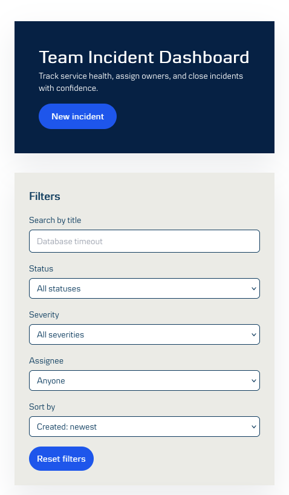
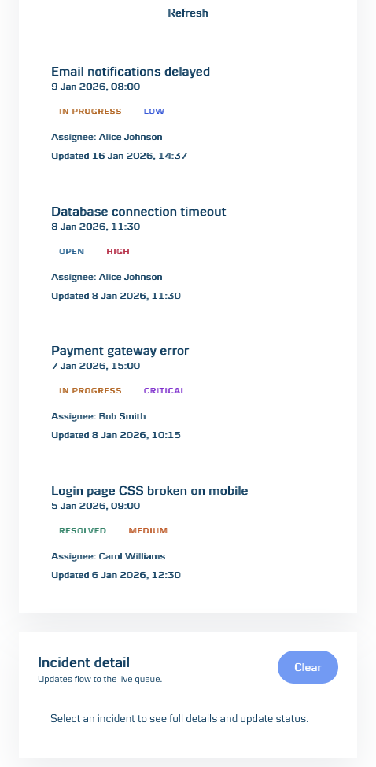

# Team Incident Dashboard

A small incident management UI built with React + TypeScript on Vite.

## How to run

Prereqs: Node.js 18+, npm.

```bash
npm install
npm run dev
```

Open `http://localhost:5173`.

## Tests

```bash
npm test
```

## Architecture & key decisions

- **App shape**: Single-page application built from React components.
- **State management**: Local React state for UI state + server data; no external state library to keep the surface area minimal for this scope.
- **Data fetching**: `fetch` against the provided mock API (`/api/*`) with explicit loading and error states.
- **Structure**: Feature-first folder layout under `src/features/incidents` with components and shared utilities split for clarity.
- **Styling**: Tailwind classes with shared style tokens in `src/features/incidents/utils/incidentStyles.ts`; global defaults in `src/index.css`.
- **Accessibility**: Semantic HTML, button elements for actions, labeled form controls, and dialog role/labels for the create modal.

## Project structure

```
src/
  api/
  features/
    incidents/
      components/
      utils/
      IncidentDashboard.tsx
  test/
  index.css
  main.tsx
```

## Trade-offs & limitations

- No focus trap or return-to-trigger handling in the modal; would add with more time.
- Styling is Tailwind-only; would extract reusable variants if the design system expands.
- Mock API only; no real persistence beyond localStorage in the starter mock.

## Screenshots





## Tooling / AI usage

- Used AI assistance for 
- refactors
- iterative styling tweaks

## What I'd add if I had more time

- CI/CD pipeline
- Real data
- Data visualization giving better overview of status and severity of ticket flow
- Frontend tests
- UI component library
- Optimize for better accesability
